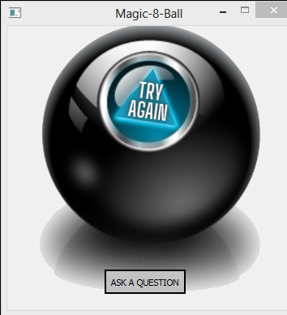

# Magic-8-Ball
A script with GUI console to play the famous fortune-teller game.

 

## Execution:
Simply clone the project on your local setup and cd to the project folder. Run magic_8_ball.py and voila!
